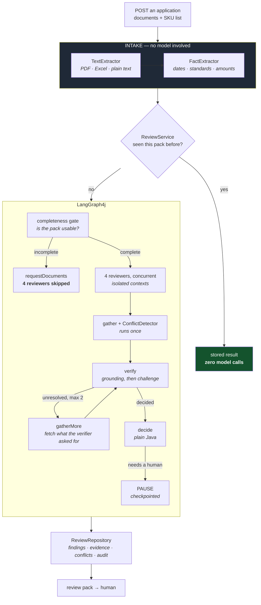
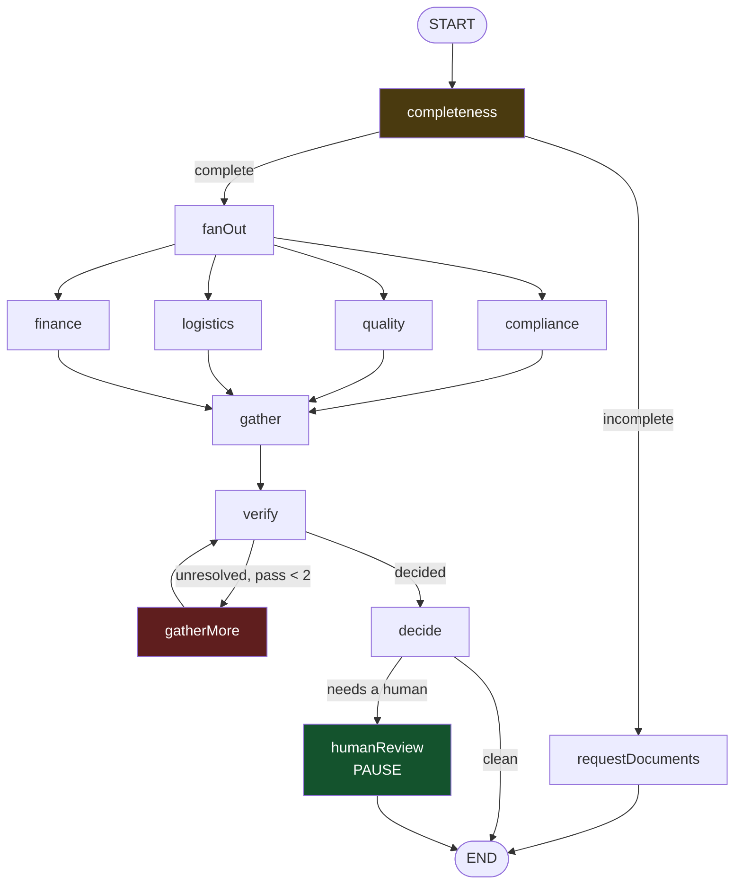

# Architecture flow

How a vendor application becomes a review pack, with the class and method at
each step.

Companion documents:
- [`code-walkthrough.md`](code-walkthrough.md) — what each class does
- [`testing.md`](testing.md) — how it is tested and measured

---

## The shape in one diagram



---

## Why multi-agent, and not one prompt

The question every interviewer asks. Three of the four justifying conditions
hold here, which is unusual.

**It is already multi-party.** Compliance, quality, logistics, finance and
governance each review the same pack today, independently, against different
rulebooks. The agents model reviewers who exist — this is not an architecture
invented for the sake of it.

**The conclusions genuinely conflict.**

```
Logistics:   "EDI-capable, 3-day lead time — ready to onboard"
Quality:     "audit certificate expired four months ago"
Compliance:  "insurance covers the EU only; we ship to the UK"
```

Three valid positions, one decision. A single agent **averages that into a
paragraph and the trade-off disappears** — and the disagreement was the most
informative thing in the review.

**Independence has to be enforced.** One context that sees the expired
certificate first colours every later judgement. That is prevented twice:
`ReviewContext` has nowhere to put another reviewer's findings, and the agent
database role has no `SELECT` on `review_finding`. **The permission is the one
that survives someone editing the class.**

**And the fan-out is not what justifies the graph library.** Running four things
concurrently is `CompletableFuture.allOf` in ten lines, and claiming otherwise
invites the obvious follow-up. Three other things in this flow are not:

| | Needs | Why hand-rolling it hurts |
|---|---|---|
| A gate that skips the rest of the pipeline | **conditional edge** | an `if` around the fan-out, until there are three such gates |
| A verifier that sends work back for another pass | **a cycle** | a `while` loop wrapped around a concurrent stage, with its own bound and its own state |
| Pausing days for a human, then resuming | **checkpointing** | serialising in-flight state, a resume path, and no way to test it |

The third is the one that would be genuinely unpleasant. It is also why every
domain record here implements `Serializable`.

---

## Stack

| Layer | Choice | Why |
|---|---|---|
| Language | Java 21 | records, sealed types, virtual threads |
| Framework | Spring Boot 4.1.1 | |
| AI | **Spring AI 2.0.1** | picked over LangChain4j for its **MCP server** starter |
| Orchestration | **LangGraph4j 1.8.24** | conditional edges, cycles, checkpointing |
| Model | `gemini-3.6-flash`, pinned | **not** `-latest`: an alias would swap the model under a measurement |
| Tools | MCP over a **read-only** Postgres role | |
| Documents | PDFBox, Apache POI, Gemini vision | |
| Persistence | Postgres 16 + Flyway | |

**Every version was read from `repo1.maven.org` metadata, not the Maven search
API** — which reported `langgraph4j 1.6.0-beta5` when `1.8.24` stable existed,
and changed the project estimate by four hours.

---

## Stage 1 — Intake, before any model

```
bytes → TextExtractor.extract()      → ExtractedText  (per page)
      → SkuSheetParser.parse()       → List<Sku>      (from .xlsx)
      → FactExtractor.extract()      → DocumentFacts  (dates, standards, amounts)
```

**The design principle the whole system rests on:**

| Operation | Time | Relative |
|---|---|---|
| Regex over document text | 0.1 ms | 1× |
| Parse a 400-row spreadsheet | 40 ms | 400× |
| **One model call** | **30,000 ms** | **300,000×** |

So the pipeline **parses first and asks second**. Every date, standard and amount
extracted by `FactExtractor` is a question the model never has to answer — and
models are unreliable at date arithmetic, so this buys accuracy as well as speed.

### Three routes in, with different trust

```
PDF with a text layer  →  PDFBox        →  NATIVE_TEXT    exact
Excel / plain text     →  POI / decode  →  NATIVE_TEXT    exact
scanned PDF            →  Gemini vision →  MODEL_VISION   probabilistic
```

`ExtractionSource` travels with every parsed value, and it changes what may be
concluded:

- `MODEL_VISION` **cannot** produce a `DETERMINISTIC` finding — the comparison is
  exact but the input was a model reading a possibly-smudged image
- its evidence cannot be grounded by substring match — there is no source text
- anything BLOCKING built on one goes to a human

### The fail-closed check worth naming

A scan is a valid PDF with pages and no text. Treat that as "an empty document"
and something backwards happens:

```
completeness → file is present   ✅ passes
compliance   → nothing to find   ✅ no findings
                                 ─────────────
                 vendor appears compliant because their
                 certificate was unreadable
```

`ExtractedText.hasNoTextLayer()` catches it. The page is read by vision, or the
document is rejected — never passed on.

---

## Stage 2 — Idempotency, before the expensive part

```java
ReviewService.submit(context)
    → idempotencyKey(context)          // sha256 of application + documents
    → repository.findByIdempotencyKey  // hit? return stored, ZERO model calls
    → graph.review(context)
    → repository.save(state, key)
```

**The check has to come before the work.** Running five reviewers, spending five
model calls and two minutes, then discovering the result was already stored would
make the check pointless.

The key is derived from content, so an unchanged pack is recognised even if the
caller forgot to send a key — and a corrected certificate produces a different
key and is reviewed again, which is correct.

---

## Stage 3 — The graph



### The three features, and what each is actually worth

**The gate (conditional edge).** A pack missing three mandatory documents does
not need four reviewers arguing about its contents — it needs the documents.
Skipping them saves four model calls and about two minutes, and incomplete
submissions are the common case. It also stops the system asking for documents
one at a time, which is what turns a two-week delay into an eight-week one.

**The verify cycle.** When the verifier cannot decide, it names the *specific*
thing that would settle it — not "more information" but *"whether policy
PL-4471029 has a territorial endorsement"*. `gatherMore` then reads the
retailer's rulebook for this category and delivery model and hands it back, and
`verify` looks again with it. Findings that would otherwise land on a person's
desk get settled by a SQL query.

Three ways out of the loop, and only one of them is the counter:

| Exit | Means |
|---|---|
| nothing unresolved | the cycle did its job |
| nothing left to fetch | another pass would ask the same question with the same information |
| `verifyPasses == 2` | a backstop, not the schedule |

The middle one is the honest convergence condition. Without it the loop runs to
the bound every time and pays for it.

**Two cost rules the cycle has to obey**, or it is worse than not having it:

- **The rulebook is fetched lazily.** It could be pasted into all five reviewer
  prompts up front, which would remove the need for the cycle — and would be
  paid on every review of every application, for a slice needed only by
  contested findings. Longer prompts also measurably dilute attention on the
  documents the reviewer is meant to be reading.
- **A later pass re-challenges only what is still open.** Re-verifying the whole
  set is 2N model calls to learn nothing new about N−1 of them.

**The verifier names what it needs from a closed set**, so the fetch is targeted
without a model ever choosing a query:

```java
public enum EvidenceNeed { REQUIRED_DOCUMENTS, COMPLIANCE_RULES,
                           LOGISTICS_REQUIREMENTS, FINANCE_THRESHOLDS }
```

It returns *both* — prose for the audit trail (*"whether policy PL-4471029 has a
territorial endorsement"*) and an enum value that actually drives the lookup. The
prose is never parsed.

The two alternatives are both worse in the same way:

| | Problem |
|---|---|
| Keyword-match the sentence | "endorsement" matches no column; a pile of synonyms that silently fetches the wrong table on any new phrasing |
| A model call to route it | an extra call per pass, an extra failure mode, and a path where wording from a vendor's PDF influences which query runs |

An enum has neither. The model picks a valid name or the response fails to bind.

**And it makes the fetch narrow enough to justify itself** — one table instead of
four. That is the difference between *"we fetched what it asked for"* and *"we
fetched everything and hoped"*.

**An empty `needs` is a real answer.** It means nothing in the rulebook would
settle this, so no pass is spent discovering that: the finding survives and goes
to a person.

**The pause.** Anything blocking checkpoints and stops. A person decides on
Thursday and the run resumes where it stopped, rather than re-reviewing
everything or holding a request open for two days.

```java
.interruptBefore(HUMAN_REVIEW_NODE)   // stop BEFORE, so nothing is decided
.recursionLimit(40)                   // backstop if the pass counter breaks
```

Resuming is `GraphInput.resume()`, **not** an empty argument map — the map is
read as the input to a *new* run, which starts again at the gate and pays for
every reviewer twice. The only symptom is a slow resume and a bill.

### The fan-out is genuinely concurrent — and that took a fix

```java
// Looks parallel. Is not: node_async wraps a SYNCHRONOUS function and
// computes it eagerly on the calling thread.
builder.addNode(node, node_async(state -> runReviewer(reviewer, state)));

// Actually parallel.
AsyncNodeAction<ReviewState> action = state ->
        CompletableFuture.supplyAsync(() -> runReviewer(reviewer, state), pool);
```

Without a timing assertion this would have shipped as a "parallel" pipeline that
was nine minutes rather than two, and the architecture diagram would have been
wrong in a way nobody could see.

**Bounded at 2 concurrent calls.** Five at once into a free tier rate-limits, and
a rate-limited reviewer is a reviewer that *did not run*.

### The point worth making

> The reviewers were already isolated so one could not anchor on another's
> findings. That isolation is exactly what made them safe to run concurrently.
> **The correctness requirement paid for the performance fix.**

### `ReviewState` — and the channel that bites

Graph state is a `Map<String, Object>`; nodes return updates rather than
mutating. A returned key **replaces** by default, which is wrong when five
reviewers all return findings — the last would win and four would vanish.

```java
FINDINGS, Channels.<ReviewFinding>appenderWithDuplicate(List::of)
```

`appenderWithDuplicate`, not `appender`: the plain variant drops a value equal to
one already present, so two reviewers raising the same problem — or a node
running twice through a cycle — would be silently lost.

**`FAILURES` is a separate channel from `FINDINGS`**, so a reviewer that could
not run never looks like one that found nothing.

### The channel bug that only appears once a node sits before the fan-out

Adding the completeness gate silently broke every count in the system. Five
reviewers, five findings — and `findings().size()` returned 6.

The gate did **not** run twice; a print inside it proved that. What happens is
that when LangGraph4j merges the four parallel branches, it re-applies the
updates recorded *before* the fork. Against a replace channel that is a no-op.
Against an appender it is not: every pre-fork value lands twice.

```java
// Written by the gate, which runs BEFORE the fork.
// Absent from SCHEMA, so it replaces - and re-applying a replace is idempotent.
public static final String GATE_FINDINGS = "gateFindings";

public List<ReviewFinding> findings() {
    return join(GATE_FINDINGS, FINDINGS);   // callers see one list
}
```

The reason it is worth telling: **nothing threw, and both copies were identical
and individually valid.** The gate's finding was simply counted twice, which
would have shifted every precision number in the measurement without leaving a
trace. The regression test is one line — no node may appear twice in a run with
no cycle.

The general rule this produced, which also covers checkpoint replay:

> A node's channel must be **idempotent under re-application** unless the node
> sits somewhere re-application cannot happen.

---

## Stage 4 — Verification, cheapest check first

```
GroundingCheck.check()            free, substring search
   │
   ├─ UNGROUNDED   → discarded and recorded. Never challenged, never shown
   ├─ UNVERIFIABLE → survives, flagged (scan — no source text)
   └─ GROUNDED     → BLOCKING or MAJOR?  → VerifierAgent.challenge()
                     MINOR or INFO?      → survives unchallenged
```

Nothing is spent challenging a finding that was never grounded.

### Grounding is the guardrail I would defend hardest

The worst thing this system can produce is **not** a missed problem. It is a
confident, well-written finding citing a certificate clause that does not exist.
A reviewer who checks two citations and finds them invented stops trusting every
finding the system will ever produce — including the correct ones.

Whitespace is normalised (PDF extraction inserts line breaks a model will not
reproduce); wording is not (a paraphrase is not a quote).

### A correction to the usual advice

Standard guidance for adversarial verification is *"default to refuted when
uncertain"*, because a false positive is usually the expensive failure.

**Inverted here.** A dropped BLOCKING finding means a non-compliant vendor ships
to stores; a surviving false positive costs a human five minutes. So the verifier
must positively demonstrate a finding is wrong, or it stands — and a verifier
that could not run says so in the reason rather than letting a reader assume the
challenge passed.

---

## Stage 5 — Conflicts, surfaced not resolved

`ConflictDetector`, no model involved:

| | When | Strength |
|---|---|---|
| `SkuDispute` | Two reviewers, same SKU, severities ≥2 apart | Strong |
| `DocumentDispute` | Two reviewers, same document, ≥2 apart | Weaker |

**A conflict is never resolved automatically.** Both positions and both pieces of
evidence go to a human, because at least one finding is wrong and deciding which
is a business judgement.

Half the detector's tests assert something is **not** a conflict. BLOCKING vs
MAJOR is two reviewers weighting the same problem slightly differently; flagging
it would be noise, and noise is what gets a review tool switched off.

---

## The security model, layered

```
1. Injection scanning        advisory — can be evaded
2. Spotlighting              advisory — can be argued around
3. Typed output              structural — AgentFinding has no `approved` field
4. Read-only database role   absolute — Postgres refuses
```

Only the last cannot be talked out of:

```sql
GRANT SELECT ON required_document, compliance_rule,
                logistics_requirement, finance_threshold  TO review_agent;
-- application, review_finding, audit_entry: never granted
-- INSERT/UPDATE/DELETE: never granted, on anything
```

**The omission is the design.** An agent cannot rewrite the rules it is judged
against, cannot read another reviewer's findings, and cannot alter its own audit
trail. Three tests assert exactly that.

### The LLM proposes; Java decides

```java
record AgentFinding(Severity severity, String problem, List<Evidence> evidence,
                    CheckType checkType, double confidence, String skuRef)
```

No `approved` field exists, so no injected text can produce one. `ReviewArea` and
`FindingSource` are stamped on **after** the model answers, so a compliance
reviewer cannot claim to be the finance reviewer.

Thresholds live in `application.yml` and are read by plain Java — **no threshold
is ever in a prompt to be argued with.**

---

## Where to look in the code

| Stage | Class | Method |
|---|---|---|
| Text out of files | `intake/TextExtractor` | `extract()` |
| SKUs out of Excel | `intake/SkuSheetParser` | `parse()` |
| Facts without a model | `intake/FactExtractor` | `extract()` |
| Idempotency | `ReviewService` | `submit()`, `idempotencyKey()` |
| The graph | `graph/ReviewGraph` | constructor, `runReviewer()` |
| Shared state | `graph/ReviewState` | `SCHEMA` |
| One reviewer | `agents/ReviewerAgent` | `review()` |
| Untrusted text | `agents/Spotlight` | `wrap()` |
| Prompt versions | `agents/PromptLibrary` | `get()` |
| Citations | `graph/GroundingCheck` | `check()` |
| Challenge | `agents/VerifierAgent` | `challenge()` |
| Disagreement | `graph/ConflictDetector` | `detect()` |
| Tools | `mcp/ReferenceDataTools` | four `@Tool` methods |
| Permissions | `db/migration/V3__agent_read_only_role.sql` | |
| Storage | `persistence/ReviewRepository` | `save()` |
